In diesem Post möchte ich erkläre, wie man tatsächlich ein Möbelstück selbst baut - am Beispiel eines einfachen höhenverstellbaren Schreibtisches mit einem kleinen Regal für 1-2 Monitoren.
Anschließend will ich noch meinen eigenen Schreibtisch sowie zwei weitere Möbelstücke, welche ich gebaut habe, vorstellen, um für eigene Projekte zu motivieren.

## Anforderungen:

Hier eine Liste an Anforderungen, die ich anfangs an meinen Schreibtisch hatte:
 - Tief genug, um vor den Monitoren ausreichend Arbeitsfläche zu haben (Maße: 120 cm × 80 cm)
 - Höhenverstellbar, um ergonomisch arbeiten zu können
 - Regal für Monitore, da meine Bildschirme keine höhenverstellbaren Ständer haben und ich sie auf Kopfhöhe bringen will.

Falls ihr diesen Blogbeitrag zum Nachbauen verwendet, könnt ihr natürlich andere Maße wählen – die Tischgestelle lassen sich in der Breite meist anpassen, und in der Tiefe ist man sowieso flexibel.

## Material
 - Tischlerplatte
   - **Maße:** 1350 mm x 1200 mm, 15 mm dick
   - Habe ich im lokalen Baumarkt gekauft, dort kann man sich die Platte auch auf die gewünschten Maße zuschneiden lassen.
 - Holzlatte
   - Länge: 2500 mm (idealerweise am Stück im Baumarkt erhältlich, ansonsten tun’s auch zwei bis drei kürzere Latten, diese sollten aber nicht kürzer als die Stücke sein)
   - Wird in folgende Stücke zersägt:
     - 1x 1100 mm
     - 2x 700 mm
   - Die anderen Maße sind nicht so wichtig, ca. 45 mm hoch und 25 mm breit sind ausreichend
   - Achtung: Es ist wichtig, eine möglichst gerade Holzlatte im Baumarkt auszusuchen! Oft sind diese sehr verzogen (Holz arbeitet), daher muss man etwas suchen und sich verschiedene Latten anschauen.
 - Höhenverstellbares Tischgestell (ohne Tischplatte!)
   - Ich habe mir damals ein manuell verstellbares Tischgestell von FlexiSpot besorgt, dieses ist mittlerweile jedoch nicht mehr im Sortiment.
   - Alternativen findet man problemlos online, einfach im Internet danach suchen.
 - Schrauben
   - Je nach Dicke der Platte und der Latten solltet ihr passende Holzschrauben zur Hand haben.
   - Am besten habe die Schrauben ein Senkkopf

## Werkzeug

 - Akkuschrauber + Zubehör
 - Stichsäge + Zubehör
 - Schmirgelpapier

*Näheres, wie z.B. Zubehör, siehe unter [tools](./tools).*

## Bauanleitung

Aus zeitlichen Gründen beim Schreiben dieses Blogs wird dies eine eher grobe Bauanleitung.
Unser gewünschtes Endresultat soll wie folgt aussehen:

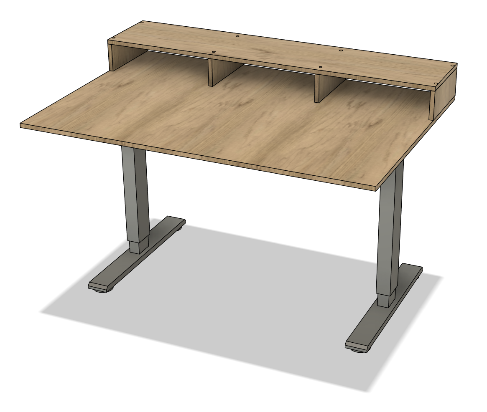

### 1. Zusägen der Tischlerplatte

Unsere Tischlerplatte hat die Maße 1350 mm x 1200 mm und muss in folgende Teile zersägt werden:
 - Tischplatte  
   **Maße:** 1200 mm x 800 mm
 - Regalplatte  
   **Maße:** 1200 mm x 250 mm
 - Regalstützen (4 Stück - aus dem Rest der Platte ca. 300 mm)  
   **Maße:** 250 mm x 100 mm  
   *(Hinweis: Eine Stichsäge entfernt etwa 1 mm Material pro Schnitt.)*

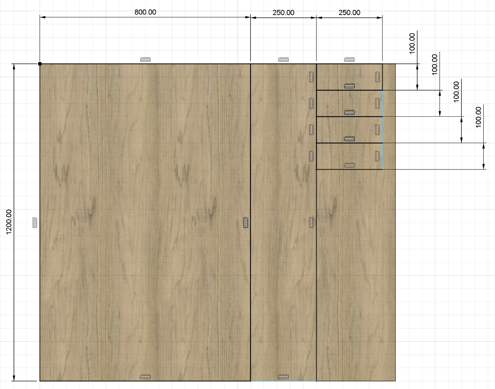

**Vorgehensweise beim Sägen:**

Mit einem Bleistift werden die Linien angezeichnet, entlang derer ihr sägen wollt.
Achtet beim Sägen darauf, nicht direkt auf der Linie zu sägen, sondern leicht daneben, also außerhalb des Teils, welches ihr behalten wollt.
Nach dem Sägen solltet ihr die Kanten mit etwas Schleifpapier glätten bzw. abrunden.

### 2. Zersägen der Holzlatte

Die Holzlatte muss in drei Teile zersägt werden, welche später unter der Tischplatte befestigt werden.
Dies dient der Stabilisierung, alternative könnte auch eine dickere Tischplatte verwendet werden.
 - Stützlatte Mitte:  
   **Maße:** 1100 mm (x 45 mm x 25 mm) (Länge x Höhe x Breite)
 - Stützlatte links & rechts:  
   **Maße:** je 700 mm (x 45 mm x 25 mm) (Länge x Höhe x Breite)

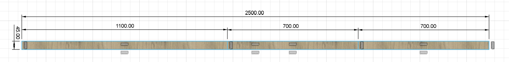

Diese drei Latten werden im nächsten Schritt individuell zugesägt, um später exakt zu passen:

 - Linkes Stützteil (700 mm):  
   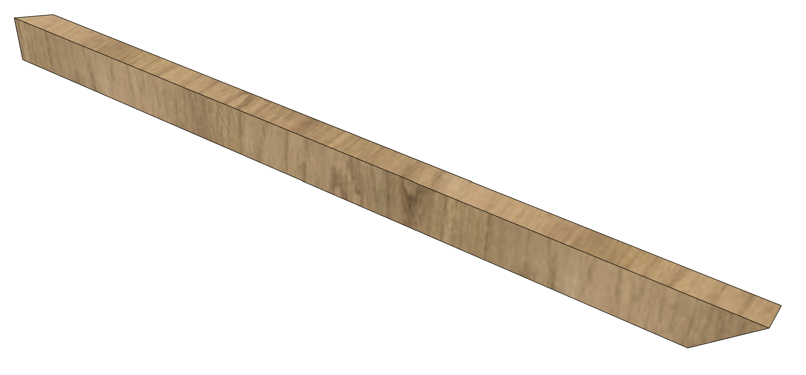  
   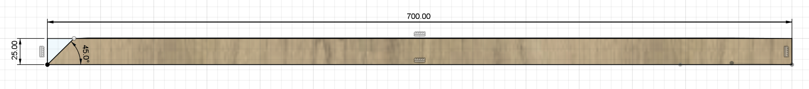  
   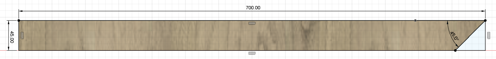  
 - Rechtes Stützteil (700 mm):  
   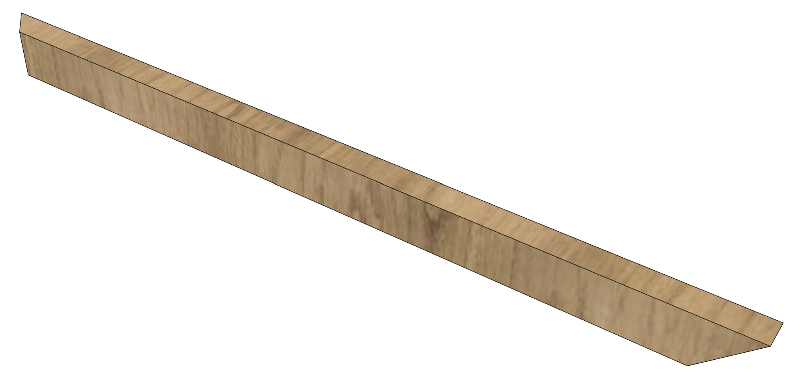  
   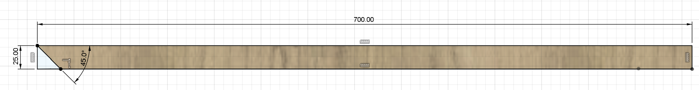  
   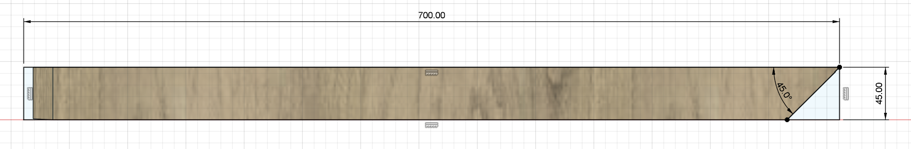  
 - Mittleres Stützteil:  
   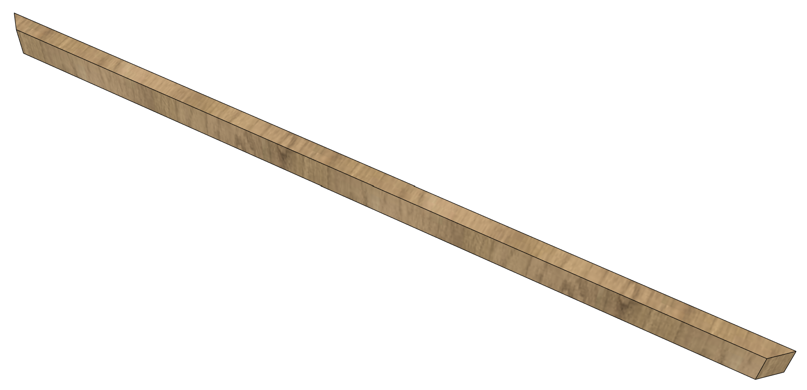  
   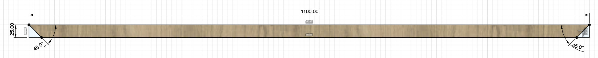

ACHTUNG! Die linken und rechten Stützteile sind gespiegelt, also nicht identisch!

Das Zuschneiden erfolgt analog zum Vorgehen bei der Tischplatte (siehe oben).

### 3. Verbinden von Stützlatten mit der Tischplatte

Als Nächstes werden die Stützlatten mit der Tischplatte verbunden.
Diese haben immer (also auf allen vier Seiten) einen Abstand von 50 mm (5 cm) vom Rand der Tischplatte.

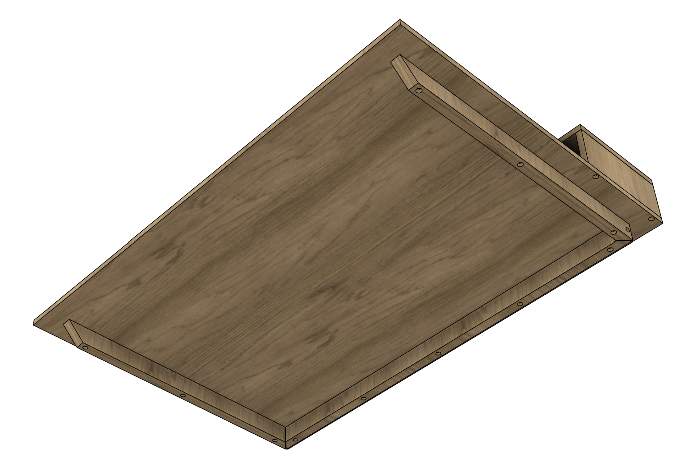

**Vorgehensweise:**
1. Löcher in Stützlatten vorbohren
   - Dafür wird der Akkuschrauber verwendet
   - Die genaue Position der Löcher ist dabei nicht so wichtig, orientiere dich einfach an der Verteilung auf dem Bild:
     - Seitliche Stützlatten: jeweils 3 Schrauben
     - Mittlere Stützlatte: 5 schrauben
   - Der verwendete Bohrer sollte dabei dünner als die Schraube sein, damit sich diese später fest im Holz verankern kann.
   - Danach mit einem Kegelsenker die Bohrlöcher ansenken, damit der Schraubenkopf bündig mit dem Holz abschließt.
2. Stützlatten auf der (Unterseite) der Tischplatte ausrichten
   - Alle drei Stützlatten sollen ein Abstand von 50 mm zum Plattenrand haben, diese Position muss auch beim Verschrauben eingehalten werden.
3. Stützlatten mit der Tischplatte verschrauben
   - Durch die vorgebohrten Löcher werden die Stützlatten festgeschraubt
   - Achte hierbei darauf, dass die Schrauben nicht durch die Tischplatte hindurchragen, um Verletzungsgefahr und eine unschöne Oberfläche zu vermeiden.
   - Die Tischplatte ist 15 mm dick &rarr; die Schrauben sollten maximal 10 mm in die Platte eindringen
     - Da das Stützteil 45 mm hoch ist, ergibt sich eine ideale Schraubenlänge von 50 bis 55 mm
     - Falls du nur kürzere Schrauben (z. B. 45 mm) hast, kannst du das Loch mithilfe des Kegelsenkers etwas tiefer machen.

### 4. Anbringen des Monitor-Regals

Zum Schluss wird das Monitor-Regal auf der Tischplatte montiert. Zuerst wird das Regal selbst zusammengebaut:

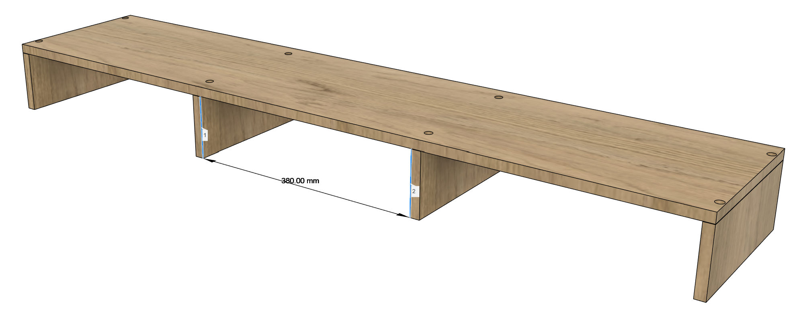

Das Regal besteht aus:
 - 1 Regalplatte (1200 mm x 250 mm)
 - 4 Regalstützen (250 mm x 100 mm)
 - 8 Schrauben (Länge ziemlich egal)

In meinem Beispiel ist der Abstand zwischen den Stützen jeweils 380 mm, das ist jedoch flexibel anpassbar.
Die beiden Stützen in der Mitte dienen nur zur Stabilisierung und müssen nicht exakt mittig positioniert werden.

Vorgehensweise zum Zusammenbau des Regals:
1. Regalstützen richtig auf der (Unterseite) der Regalplatte ausrichten  
   Es empfiehlt sich, die Mitte der Stütze auf der Oberseite der Regalplatte anzuzeichnen
2. Bohrlöcher vorbohren - durch die Regalplatte in die Stütze
3. Löcher mit dem Kegelsenker auf der Oberseite der Regalplatte ansenken
4. Stützen von oben mit der Regalplatte verschrauben

Montage des Monitor-Regals auf der Tischplatte:
 - Das Regal wird analog zu den Stützteilen mit der Tischplatte verschraubt:
   1. Regal richtig hinten an der Tischplatte ausrichten (also an dem "hinten" wo auch die Mittellatte verschraubt ist)
   2. Löcher für Schrauben vorbohren
   3. Löcher ansenken
   4. Regal Verschrauben
 - Die beiden mittleren Stützteile des Regals werden dabei nicht mit der Tischplatte verschraubt, sondern liegen nur auf dieser auf.
   Dadurch bleibt die Oberfläche in der Mitte der Tischplatte unversehrt, dies ist praktisch, sollte das Regal später einmal entfernt werden.

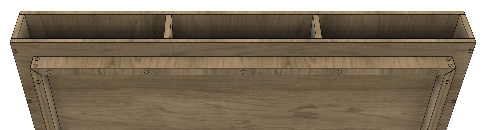

### 5. Anbringen der Tischplatte

In meinem Fall waren im Tischgestell bereits passende Löcher vorhanden und Schrauben dabei, sodass die Tischplatte einfach auf das Gestell geschraubt werden konnte.

Ich empfehle die Tischplatte nicht exakt mittig, sondern etwas nach vorne versetzt auf das Gestell zu monieren.
Der Grund: Durch die aufgestellten Bildschirme lastet mehr Gewicht auf dem hinteren Bereich der Platte.
Eine leichte Vorverlagerung sorgt für einen besseren Gewichtsausgleich und verbessert die Stabilität.

Falls dein Tischgestell eine Kurbel oder ein Bedienpult zur Höhenverstellung besitzt, muss dieses vermutlich ebenfalls noch montiert werden.
Auch hierfür sollten passende Schrauben im Lieferumfang enthalten sein.

| 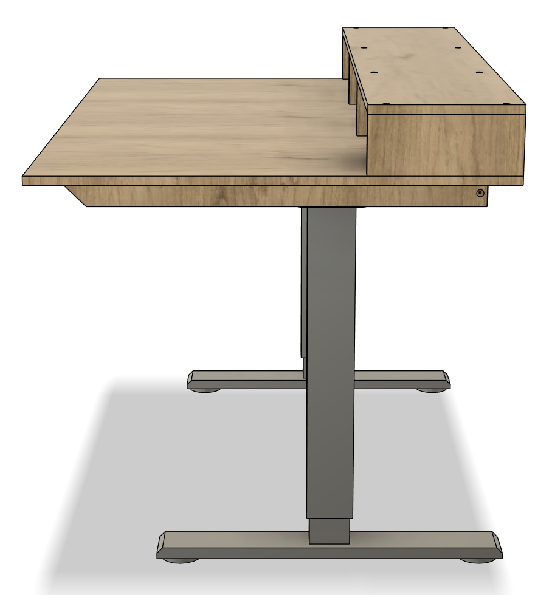 |  |
| - | - |
| Tischplatte nach vorne versetzt montiert | Fertiger Schreibtisch |

## Motivation für weiter Projekte

Zum Abschluss möchte ich euch noch ein paar meiner eigenen Projekte vorstellen.
Ziel ist es, zu inspirieren und zu zeigen, was mit relativ wenig Werkzeug, wie im vorherigen Beitrag beschrieben alles umgesetzt werden kann.

Selbst diese einfachen Werkzeuge und etwas Know-how mit Holz und dem Benutzen dieser Werkzeuge reichen aus, um individuell gestaltete, funktionale und auch langlebige Möbelstücke selbst zu bauen.

### Mein Schreibtisch

Mein Schreibtisch ist bereits im Titelbild etwas zu sehen, hier jetzt noch etwas zur Entstehungsgeschichte dieses Schreibtisches und wie dieser sich über die Jahre weiterentwickelt hat:

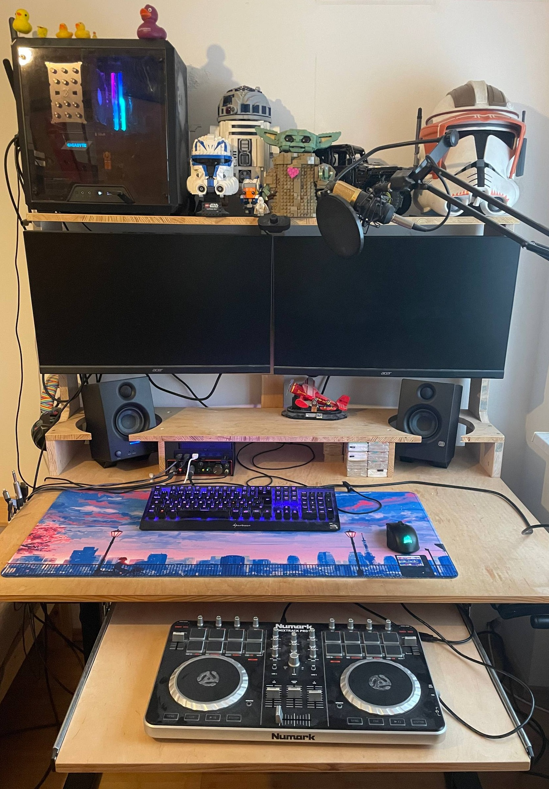

**Version 1:**

Die erste Version entstand mit der Idee, meinen PC über den Bildschirmen zu platzieren.
Die Vorteile davon waren, dass ich besser in das Gehäuse schauen kann und über den Monitoren sowieso ungenutzter Platz ist.
Da ich nichts an die Wand schrauben wollte, baute ich eine Konstruktion, die auf dem Tisch stand, also eine Art Regal, welches hinter den Bildschirmen hochging und den PC trug.

**Version 2:**

Ein Jahr später wollte ich einen höhenverstellbaren Tisch und mir waren die Monitore direkt auf der Tischplatte zu niedrig, da diese selbst nicht höhenverstellbar waren.
Deshalb baute ich, wie im Tutorial beschrieben, eine neue Tischplatte samt Regal für die Monitore, verbunden mit dem Regal aus Version 1.
Das Regal über den Bildschirmen war jetzt aber so breit wie der gesamte Tisch.

**Version 3:**

Zwei Jahre danach habe ich mir ein Set Studio-Monitore zugelegt.
Daraus erfolgten wieder Anpassungen:
 - In das Regal der Monitore wurden Aussparungen für die Studio-Monitore gesägt, damit diese unter den Bildschirmen platziert werden können.
 - Das obere Regal für den PC musste aufgrund der Monitore 7 cm erhöht werden.
 - Die Ständer der Bildschirme habe ich entfernt und stattdessen diese an Monitorarmen befestigt, welche in der Regalstruktur verschraubt sind.  
   Ein Vorteil dadurch ist, dass ich einen Monitor auch Richtung Bett schwenken und somit als eine Art Fernseher verwenden kann.
 - Unter dem Tisch habe ich eine Art Schublade (wie oben im Bild zu sehen) montiert, auf dieser hat es Platz für mein Mischpult, oder alternativ auch Maus und Tastatur.
 - Das Beste daran, da alles an den Tisch montiert ist, bleibt dieser weiterhin höhenverstellbar.

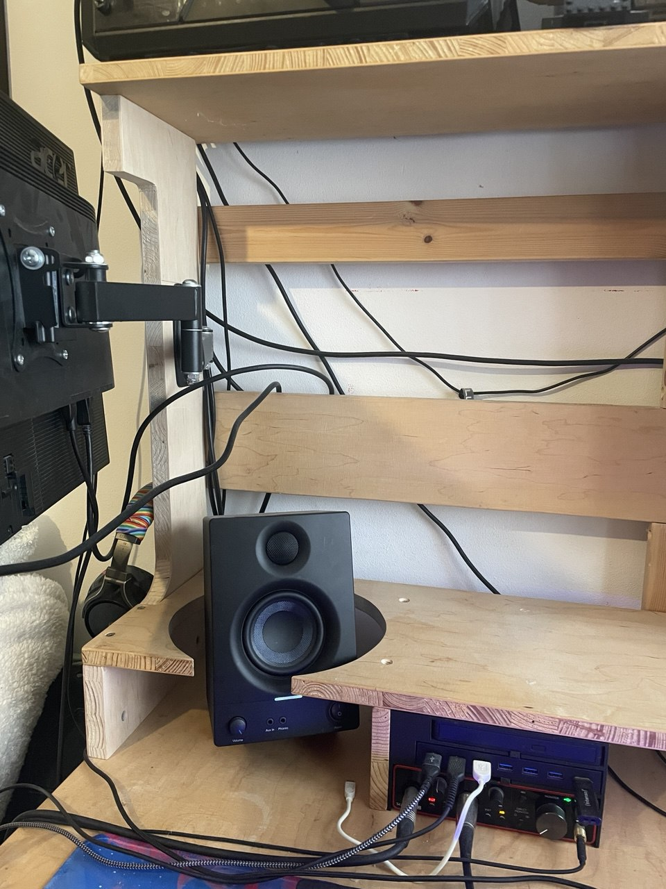

Zusätzlich habe ich mit dem 3D-Drucker Zubehör entworfen und umgesetzt:
 - Kopfhörerhalterung
 - Kabel-Organizer
 - Fach für CD/DVD-Laufwerk, USB-Hub und Audio-Interface

| 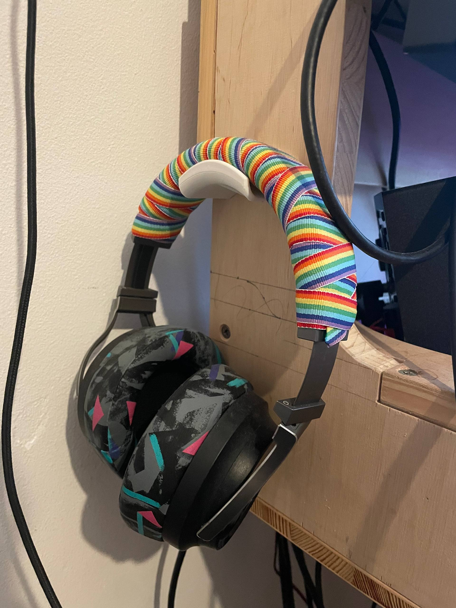 | 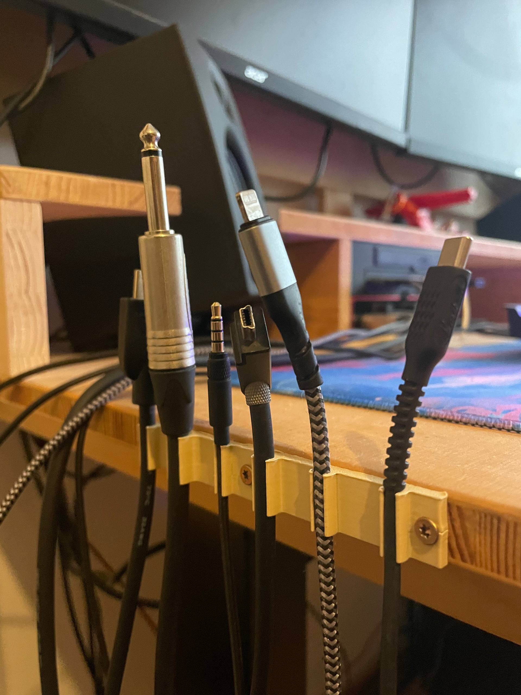 | 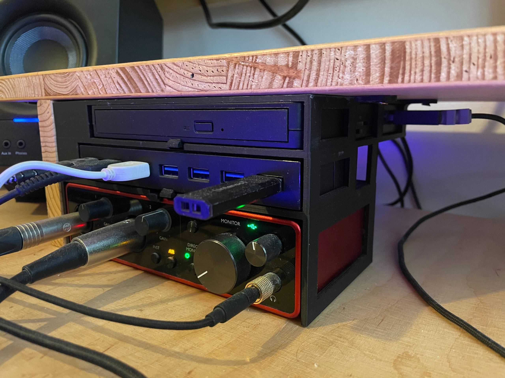 |
| - | - | - |
| Halterung für Kopfhörer | Kabelhalterung | Multifunktionsfach |

### Kommode für neben meinem Bett

Ein kleines, schnelles Projekt war der Bau einer Kommode für neben meinem Bett.

Dafür habe ich nur Holzreste, welche ich noch übrig hatte verwendet, weshalb das Design etwas "kreativ" aussieht.

Im Keller hatte ich noch ein Schubladen-Organizer gefunden, welchen ich einfach in der Kommoder eingebaut habe.
Oben habe ich Löcher in die Abdeckung gesägt und mit dem 3D-Drucker passgenaue Fächer dafür entworfen.

|  | 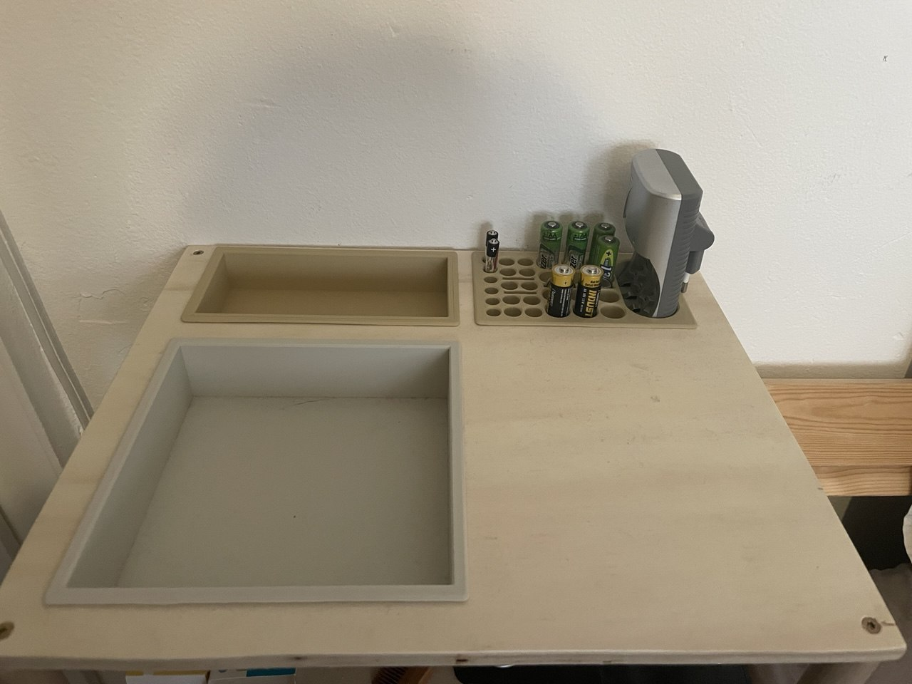 |
| - | - |
| Kommode | Fächer oben auf der Kommode |

### Sofa-Tisch

Ein größeres 3-Tage-Projekt.

Da es in meinem 11qm-Zimmer nur wenig Platz hat, musste etwas her, das flexibel ist.
Meine Anforderungen waren ein großer Tisch zum Basteln, aber auch eine gemütliche Ecke für Besuch.

Das Ergebnis, ein Möbelstück, welches sich vom Tisch zum Sofa oder andersrum umbauen lässt.
Weiter habe ich das ganze so entworfen, dass drei Euroboxen als Stauraum darunter Platz haben, diese dienen in der Sofa-Konfiguration zusätzlich auch als Stütze.
Weiter bleibt in der Sofa-Konfiguration hinten ein 15 cm breites Regal in Höhe des Tisches erhalten, dies ermöglicht das Abstellen von ein Paar Gegenständen auch in der Sofa-Konfiguration.

Auf meinem Instagram-Profil [@argimlas_](https://www.instagram.com/argimlas_) unter dem Highlight "Sofa-Table" ist auch noch ein wenig der Bauprozess dokumentiert.
Dort kannst du ggf. auch noch zu meinen anderen Projekten ein paar Bilder finden.

| 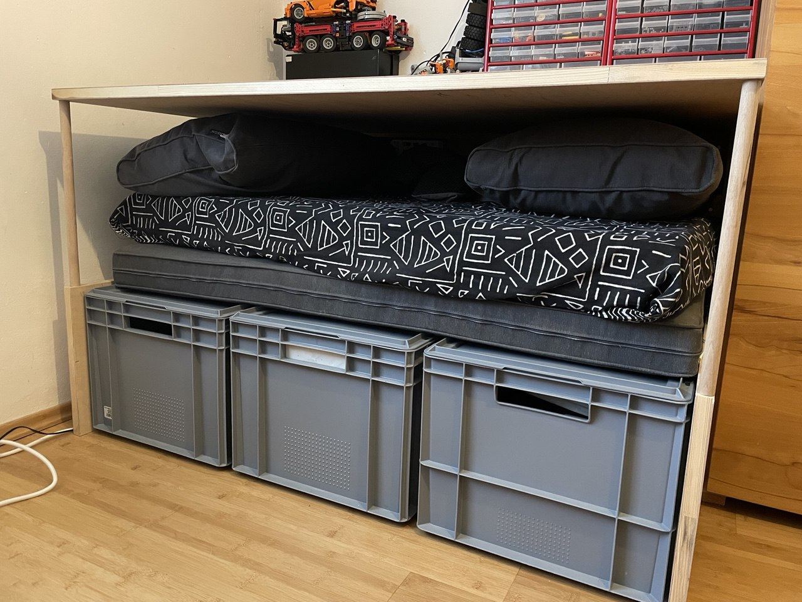  | 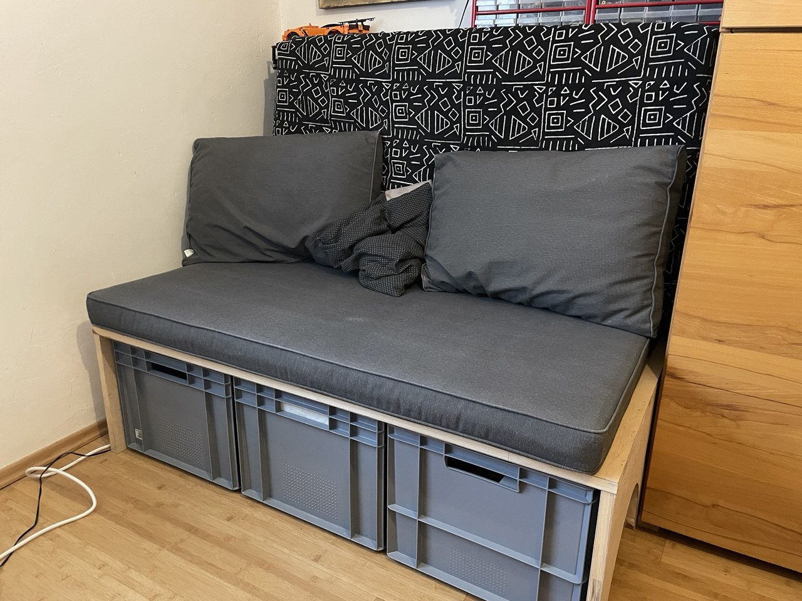 |
| - | - |
| Tisch-Konfiguration | Sofa-Konfiguration |

## Fazit

Ich hoffe, der kleine Werkzeugüberblick aus dem anderen Post, das Tutorial zum Bau eines höhenverstellbaren Tisches und die Vorstellung meiner Projekte konnten dir einen guten Einblick geben und hoffentlich sogar Lust darauf machen, selbst etwas aus Holz zu bauen.

Mit ein wenig Planung, grundlegenden Werkzeugen und Kreativität lassen sich auch mit kleinem Budget individuelle, praktische und langlebige Möbelstücke bauen.
Und das Beste: Man lernt bei jedem Projekt dazu!