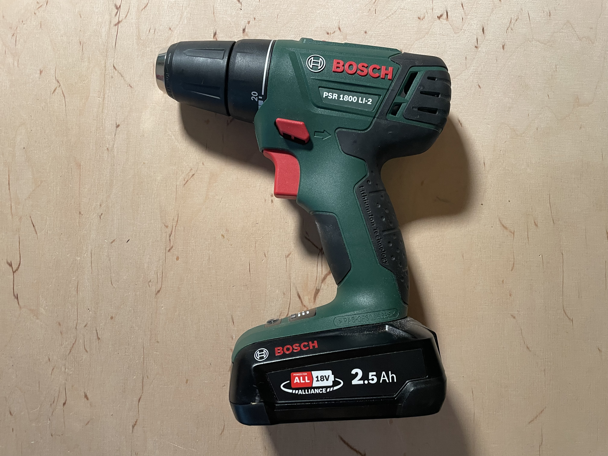
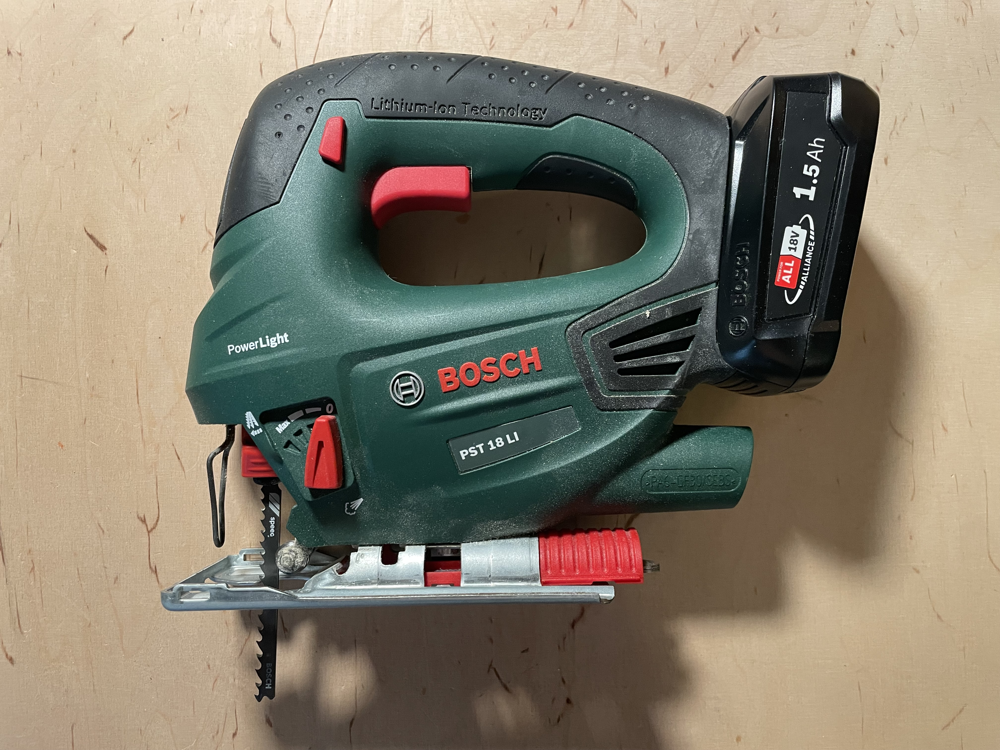
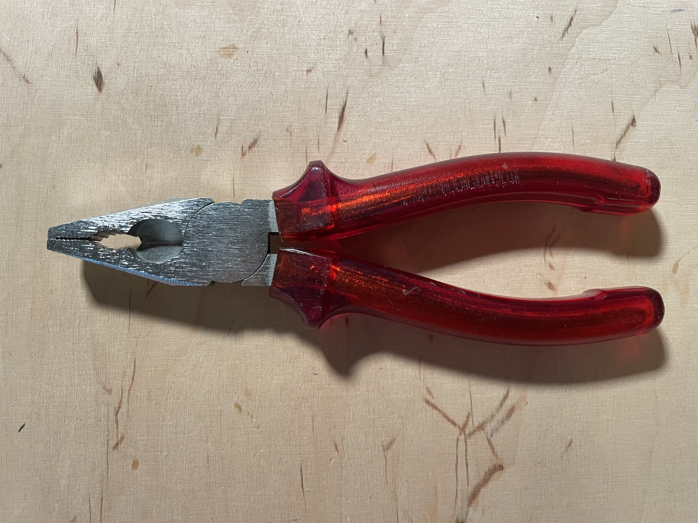
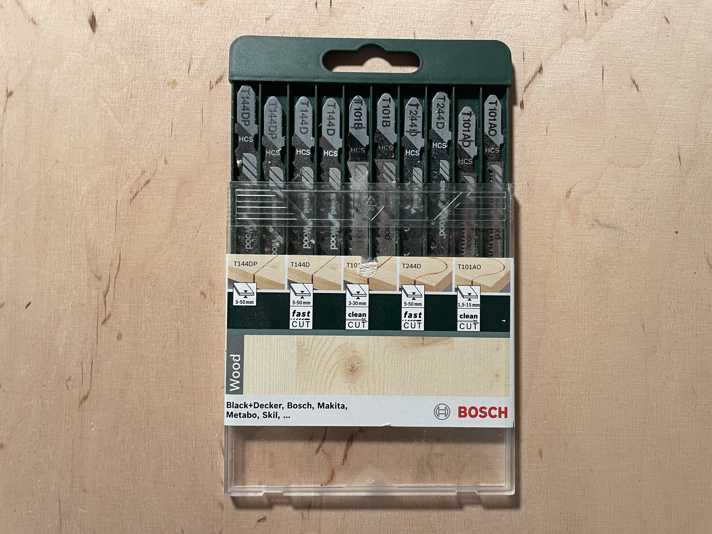
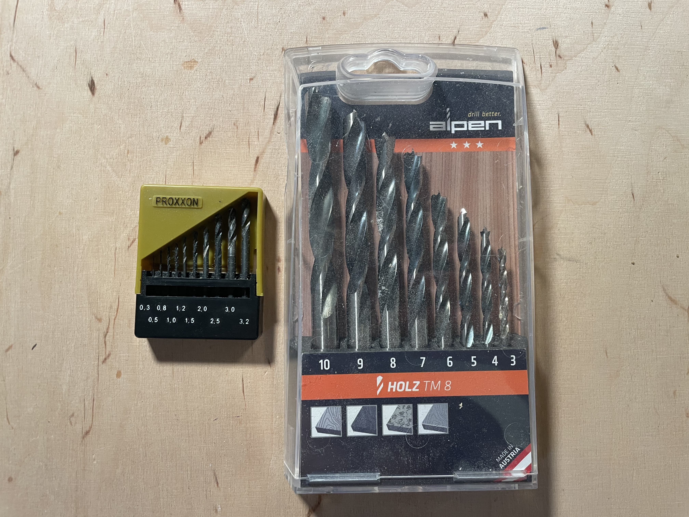
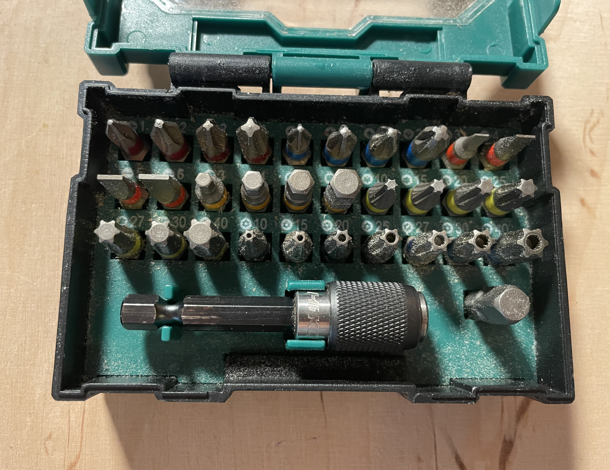
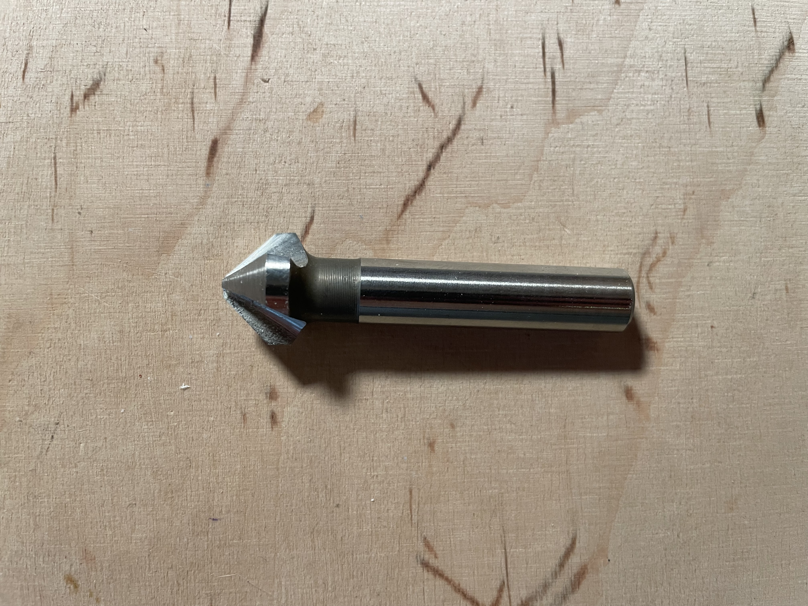

Wenn ihr etwas aus Holz bauen wollt, sind diverse Werkzeuge und Hilfsmaterial leider zwingend notwendig.
In diesem Post möchte ich etwas darauf eingehen, was man benötigt und auch wo man die verschiedenen Werkzeuge ggf. herbekommen kann, bzw. was es sonst noch für Optionen gibt.

## Benötigtes Werkzeug

Alles was ich im folgende Aufzähle ist Zwingend notwendig.

### Übersicht
 - (Akku)schrauber + Zubehör (zum Bohren von Löchern)
 - (Stich)säge + Zubehör (Zersägen von Holz)
 - Kombizange (allgemein nützlich)
 - Meterstab (abmessen von langem)
 - Lineal (präzises abmessen)
 - Bleistift (zum Anzeichen)
 - Rollgabelschlüssel (zum anziehen)
 - Schmirgelpapier (zum Abrunden)

### (Akku)schrauber

Für mich das erste Werkzeug, welches ich mir angeschafft habe - ein Akkuschrauber.
Bis jetzt bin ich mit diesem Gerät noch an keine Grenzen gestoßen.
Ob Holz, Metall, oder sogar Löcher für Regale in meiner Wand, ich konnte damit bis jetzt alls erledigen.

Um ein Holzmöbelstück zu bauen ist dieses Gerät zwingend notwendig, denn ihr müsst Löcher für Schrauben vorbohren und Schrauben verschrauben.

Ich persönlich besitze das Gerät "PSR 1800 LI-2" von Bosch und bin damit sehr zufrieden.

Ggf. gibt es auch Schrauber welche kabelgebunden sind, dann benötigt ihr eine Steckdose in der Nähe.

### (Stich)säge

Hier steht es euch grundsätzlich offen von Hand zu sägen, zum Beispiel mit einer Laubsäge.
Ist aber entsprechend anstrengend und benötigt sehr viel Zeit.

Daher empfehle ich eine elektronische Säge, zum Beispiel eine Stichsäge, diese hat den Vorteil, dass ihr auch Kreise Sägen könnt.
Dadurch ist der nachteil das wenn man etwas Perfekt gerade absägen will, dies nahezu unmöglich ist, meinen persönlichen Anforderungen genügt es jedoch.

Auch Stichsägen gibt es mit Akku, aber auch kabelgebunden, ich verwende die "PST 18 LI", wieder von Bosch.

### Sonstiges Werkzeug

| Werkzeug | Kurze Erläuterung | Bild |
| - | - | -  |
| Kombizange | Ein Allrounder-Werkzeug, immer nützlich |    Bild von |
| Meterstab | Sobald das 30cm lineal zu kurz ist zwingend notwendig zum vermessen. |  |
| Lineal | 30cm lang, handlicher als Meterstab, zum Präzisen abmessen. |  |
| Spitzer bleistift | Zum Anzeichnen von Linien, entlang welcher man sägen will oder markieren, wo ein Loch gebohrt werden soll. |   |
| Rollgabelschlüssel | Ersetzt Set an Gabelschlüsseln, gut zum anziehen von 6-Kant-Schrauben |  |
| Schleifpapier | Zum abrunden von Abgesägten Kanten |  |

### Zubehör

| Was | Warum? | Bild |
| - | - | - |
| **Stich- oder Laubsäge** |||
| Passendens set an Sägeblättern | Damit man überhaupt sägen kann. |  |
| **Akkuschrauber** |||
| Holzbohrer in verschieden größen | Damit man löcher bohren kann. |  |
| Bitsatz | Allrounder zum schrauben. |  |
| Kegelsenker | Zum erweitern eines gebohrten lochs, sodass der Kopf einer Schraube Platz hat |  |

## Woher bzw. wie komme ich an Werkzeug?

Gerade als Student eine wichtige frage ist, wie ich an das Werkzeug komme, da das Budged ggf. eine Rolle spielt.
Die erste gute anlaufstelle sind dann vermutlich Eltern, Großeltern oder andere verwandte, vielleicht hat irgendjemand Werkzeug übrig.

Eine weitere gut anlaufstelle sind Flohmärkte, ich war erst vor zwei Wochen auf einem in Stuttgart, dort gab es mehrere Stände, welche Werkzeug verkauft haben.

Falls man das Budged für eine Anschaffung hat (gerade Akkuschrauber und Stichsäge sind hier die wichtigsten) ist der gebrauchtmarkt wie z.B. Ebay o.ä. vmtl. eine gute anlaufstelle um an neuere gebrauchte Ware zu kommen.

Falls man komplett neu Kaufen will ist es nach meinen Erfahrungen fast egal ob man im lokalen Baumarkt oder online umschaut, der Vorteil am Baumarkt ist, dass man sich beraten lassen kann.
Ich persönlich vertrete die Meinung wer billig kauft, kauft zweimal, sowohl Akkuschrauber als auch Stichsäge sind langzeitanschaffungen, welche nach meiner Erfahrung mindestens 10 Jahre halten sollten.

Zu guter letzt will ich auch die Option von öffentlichen Werkstätten, wie an der Universität Ulm das [Student-Lab](https://wiki.fs-et.de/student-lab/StartSeite) oder das [Temporärhaus](https://temporaerhaus.de/make/) hinweisen.
Selbst war ich leider noch in keiner der Werkstätte, aber dort solltet ihr alles finden, was ihr benötigt und gleichzeitig sind dort erfahrene Menschen, welche euch bei fragen und Problemen Tipps gegen und ggf. sogar unterstützen können.